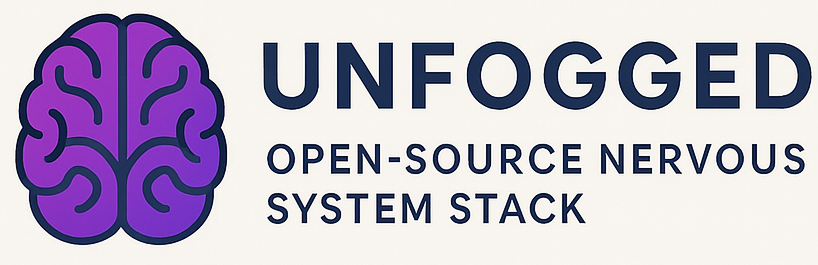

# 🧠 UNFOGGED: The Open Source Nervous System Stack

Welcome to **Unfogged™**, a nonprofit-backed, open-source protocol for people struggling with the lingering fog of stress, anxiety, alcohol dependence, and overdiagnosed mood disorders.

We are not selling a product—we're offering a method. A biological reboot. Designed to work in the real world, with real people, and yes... real gummies.

---

## 🌍 Why Just 'Unfogged'?

You might be wondering: why not call this *Unfogged from Alcohol*?

Because alcohol isn’t the only thing fogging your nervous system.

We built this for anyone suffering from:

* Chronic sleep deprivation
* Long-term stress and cortisol spikes
* Psychiatric meds (especially benzos, SSRIs, antipsychotics)
* ADHD crash-and-burn stimulant cycles
* Parenting or caregiving burnout
* Nutrient depletion (B-complex, magnesium, CoQ10, Omega-3)
* Tech overstimulation + dopamine burnout
* Unresolved trauma and emotional numbness

**Unfogged** isn’t just about quitting alcohol.
It’s about reclaiming baseline clarity—whatever broke it.

You don’t have to be sober forever. You don’t even have to drink to need this.
You just need to want your brain back.

### ✝️ Break humanities true cycle for $60/month for 3 months get to true sobriety

Because your kids deserve a whole parent.  
Because you remember the slammed doors, the yelling, the divorce, the silence, and the pain after.  
Because healing starts with one stubborn, holy decision.  

🙏 You deserve repentance.  
🕊️ You deserve the purity of a child again.  
👣 It’s time to come home to your true reality of who you are

> *“But while he was still a long way off, his father saw him and was filled with compassion for him;  
> he ran to his son, threw his arms around him and kissed him.”*  
> — **Luke 15:20**

---

## ✍️ Founder Note

I didn’t invent this stack after finishing 90 perfect days. I started building it the moment I realized my nervous system wasn’t broken—it was overloaded.

Ashwagandha didn’t just chill me out. It gave me five seconds of real presence.

In that silence, I saw my wife in the fog.
I saw how we’d both been functioning as ghosts of ourselves.

That was Day Zero. And that was enough to start building the way out.

---

## 🌍 Mission

To restore nervous system balance in anyone suffering from:

* Bipolar (especially mania-dominant)
* Chronic anxiety, panic, or GAD
* Executive dysfunction (misdiagnosed ADHD)
* Alcohol-linked mood crashes
* Sleep disruption, stress burnout, or trauma hangovers

All with **non-pharma**, **timed nutrition** and a protocol the body actually understands.

Unfogged™ is an open-source wellness initiative operated by **Cloud Blaze**, with future plans to establish a standalone public-benefit foundation.

> We believe millions of people—especially college students—are wrecking their nervous systems through alcohol and then forgetting who they were before the fog. This protocol helps people remember. Not just feel better—but remember who they *used to be*, before stress, trauma, and alcohol rewired them. Often, that means reconnecting with the most creative and influential version of themselves—their **childhood** self. That’s why this exists. To release us from dependence—biological, emotional, and social—and bring us home to ourselves.

---

## 📚 Medical Reference Index

We've collected a curated body of medical literature, expert-backed articles, and clinical guidance that supports the foundation of the Unfogged protocol.

See full breakdown here:

📁 [references/](references/)
- [cold-turkey-vs-supported.md](references/cold-turkey-vs-supported.md) – Why abrupt cessation can harm the nervous system.
- [90-day-repair.md](references/90-day-repair.md) – The science behind 90-day supplement recovery.
- [core-supplements.md](references/core-supplements.md) – Medical evidence on magnesium, B-vitamins, Omega-3, and adaptogens.
- [nervous-system-nutrition.md](references/nervous-system-nutrition.md) – How nutrients like Ashwagandha, L-Theanine, and CoQ10 help the CNS heal.
- [gut-brain-axis.md](references/gut-brain-axis.md) – Microbiome research and its role in anxiety and mood.
- [family-mental-load.md](references/family-mental-load.md) – How parental anxiety and partner stress impacts children and relationships.
- [nutritionist-guidance.md](references/nutritionist-guidance.md) – How to talk to your PCP, RD, or psychiatrist.

## 💸 Permission to Repair: 1 Human = \$89 for 90 Days

Our mission is radical accessibility:

* ✅ No prescriptions
* ✅ No shame
* ✅ No barriers

## 🧠 From Fog to Flow: What Actually Returns When You're Clear

This isn’t just about fixing fatigue or cutting back on alcohol.
It’s about *getting back the parts of yourself that went missing* while your nervous system was overloaded.

When the fog lifts, people report:

* Laughter that feels real
* Slower, warmer parenting
* Motivation that isn’t frantic
* Focus that doesn’t come from stress
* Creativity that flows instead of burns

You don’t become someone else. You become **you again.**
The one you were before burnout, over-medication, and survival mode became your personality.

This is why the protocol exists: not just to feel "better," but to *remember who you were before the fog*. 

And once you’ve felt that again—your art, your marriage, your work, and your joy will never come from the same place.

To reset 1 human’s nervous system using the **Unfogged Gummy Protocol**:

| Supplement                                 | Approx Cost (90 Days) | Coverage Details                            |
| ------------------------------------------ | --------------------- | ------------------------------------------- |
| [Centrum MultiGummies + Omega-3](https://www.amazon.com/dp/B08YS3DW5G?tag=unfogged0f-20)             | $30                  | 1 gummy/day × 2 gummies = 180 gummies (2 bottles of 110 ct) |
| [MaryRuth CoQ10 Gummies (100mg)](https://www.amazon.com/dp/B078NFVCJ7?tag=unfogged0f-20)             | $44                  | 1 gummy/day = 90 gummies (1 bottle of 90 ct)               |
| [Goli Ashwagandha Gummies](https://www.amazon.com/dp/B0B8QGMLBS?tag=unfogged0f-20)                   | $60                  | 2 gummies/day = 180 gummies (3 bottles of 60 ct)           |
| [duwhot L-Theanine Gummies (as needed in afternoon)](https://www.amazon.com/dp/B0D83F2TB5?tag=unfogged0f-20)                  | $19                  | 1 gummy/day (1 bottle of 60 ct)              |
| [CALM Sleep Gummies (Magnesium + Melatonin)](https://www.amazon.com/dp/B085HK5LY2?tag=unfogged0f-20) | $50                  | 2 gummies/day = 180 gummies (2 bottles of 90 ct)           |
| **Total (1 person, 90 days)**              | **≈ $184-203 Retail USD or about $60 dollars a month**        |                                               |

This stack rebuilds your:

* Mitochondrial energy
* Neurotransmitter stability
* Stress/cortisol rhythm
* Sleep architecture
* Emotional resilience

> For less than \$1/day, you give someone permission to **reclaim their clarity**.

🔔 **If you only buy one supplement to start with—make it Ashwagandha.**

### 🍷 The 5PM Beer vs. the 3AM Shame

This is the moment we all know too well:

* You hit 5PM, your nervous system is fried, the house is chaos, and that glass of wine or beer feels like the only way to turn down the volume.
* Then at 3AM, you’re wide awake. Regret. Brain on fire. Shame loop. Can’t sleep. Can’t calm down.

That’s not just a bad habit. It’s a **biological cortisol-dopamine loop**—your stress hormones spike, your reward system tries to compensate, and your body demands sedation.

Ashwagandha is one of the only natural compounds clinically shown to regulate that cortisol surge *before* it reaches your brain’s emergency button.

> No shame. No judgment. Just a better way to interrupt the cycle before it hijacks your night.
> That 5PM glass of wine you reach for to calm the chaos? That’s your cortisol screaming. Ashwagandha helps regulate that surge so your brain doesn’t reach for alcohol just to shut down.

---

## 🗓️ Daily Supplement Schedule (Simple & Repeatable)

| Time          | Supplements                              | Purpose                                         |
| ------------- | ---------------------------------------- | ----------------------------------------------- |
| **Morning**   | Centrum + Omega-3 (2 gummies)            | Foundational nutrients, B-vitamins, D3, Omega-3 |
|               | CoQ10 (1 gummy)                          | Mitochondrial repair + brain energy             |
| **Afternoon** | Ashwagandha (2 gummies)                  | Cortisol modulation, mood + stress support      |
|               | L-Theanine (1 gummy, optional as needed) | Anxiety rescue, nervous system balance          |
| **Evening**   | CALM Sleep Gummies (2 gummies)           | Magnesium + Melatonin for sleep, GABA, repair   |

Keep it on your counter. Put it in a dish. Set GCal reminders if needed. This is **your ritual now.**

---

## 💝 Sponsor a Human (Beta)

Want to help someone who can’t afford \$89 for a 90-day recovery?

Right now, we’re manually matching funds to real people in need via **Cloud Blaze**. Your contribution buys:

* Full 90-day stack
* Printed protocol guide
* Entry into the Unfogged peer community (invite-only)

➡️ [Become a Sponsor](https://yoururl.com/sponsor-form)
📬 [Request a Stack via Email](mailto:support@unfogged.org?subject=Request%20for%20Unfogged%20Stack&body=Hi%20team%2C%0A%0AI%27d%20like%20to%20request%20support%20for%20the%2090-day%20Unfogged%20protocol.%20Please%20let%20me%20know%20what%20info%20you%20need%20from%20me.%0A%0AThanks%2C)

One human. One stack. One shot at clarity.

---

## 📦 Structure

unfogged-stack/
### 📂 Folder Structure

- [stacks/](stacks/)
  - [anxiety.md](stacks/anxiety.md)
  - [mania.md](stacks/mania.md)
  - [adhd.md](stacks/adhd.md)
  - [depression.md](stacks/depression.md)
  - [post-alcohol.md](stacks/post-alcohol.md)
  - [universal-reset.md](stacks/universal-reset.md)
- [protocols/](protocols/)
  - [90-day-reset.md](protocols/90-day-reset.md)
  - [7-day-binge-recovery.md](protocols/7-day-binge-recovery.md)
  - [maintenance.md](protocols/maintenance.md)
- [sourcing/](sourcing/)
  - [supplements.csv](sourcing/supplements.csv)
  - [brands-vs-cost-analysis.md](sourcing/brands-vs-cost-analysis.md)
  - [how-to-make-your-own.md](sourcing/how-to-make-your-own.md)
- [nonprofit-model/](nonprofit-model/)
  - [mission.md](nonprofit-model/mission.md)
  - [open-license.md](nonprofit-model/open-license.md)
  - [manufacturing-costs.md](nonprofit-model/manufacturing-costs.md)
- [media/](media/)
  - [unfogged-logo.png](media/unfogged-logo.png)
  - [printable-daily-log.md](media/printable-daily-log.md)

--- 
 
## 💊 Key Supplements in the Core Stack
| Supplement                    | Purpose                                                        |
| ----------------------------- | -------------------------------------------------------------- |
| [**B-Complex + Biotin/Folate**](https://www.amazon.com/dp/B08YS3DW5G?tag=unfogged0f-20) | Neurotransmitter fuel, energy, methylation                     |
| [**CoQ10**](https://www.amazon.com/dp/B078NFVCJ7?tag=unfogged0f-20)                     | Mitochondrial recovery, mood clarity                           |
| [**Omega-3**](https://www.amazon.com/dp/B08YS3DW5G?tag=unfogged0f-20)                   | Brain repair, inflammation modulation                          |
| [**Ashwagandha**](https://www.amazon.com/dp/B0B8QGMLBS?tag=unfogged0f-20)               | Cortisol and HPA regulation (critical for 5PM alcohol impulse) |
| [**L-Theanine**](https://www.amazon.com/dp/B085HK5LY2?tag=unfogged0f-20)                | Glutamate modulation, calm without sedation                    |
| [**Magnesium + Melatonin**](https://www.amazon.com/dp/B085HK5LY2?tag=unfogged0f-20)     | Sleep quality, GABA support                                    |

---

## 🔁 If You Slip Up After 90 Days

Let’s be real: some people will binge again after the reset. That doesn’t mean you failed. It means you're human.

What matters is what you do *after* the binge. If your nervous system has been reset, it's more sensitive—and more responsive—to support.

That’s why we built this:

➡️ **[7-day-binge-recovery.md](protocols/7-day-binge-recovery.md)**

It’s a short-cycle repair protocol. It helps:

* Calm glutamate spikes
* Rebalance GABA
* Reduce neuroinflammation
* Restore sleep quality

It’s not a punishment. It’s a landing pad. And it works.

---

## 📅 Daly Protocol Dosage for 90 days (Gummy Count)

* [x] **Morning**  
  - B-Complex + Omega-3: **2 gummies** (Centrum or equivalent)  
  - CoQ10: **1 gummy**

* [x] **Midday**  
  - Ashwagandha: **2 gummies** (Goli or equivalent)  
  - L-Theanine: **1 gummy (optional/as needed)**

* [x] **Evening**  
  - Magnesium + Melatonin (CALM Sleep): **2 gummies**  
  - (Optional): **L-Theanine: 1 gummy** (for nighttime anxiety or racing thoughts)

See [protocols/90-day-reset.md](protocols/90-day-reset.md) for dosage, scheduling, and alternatives.

---

## ⚔️ Why the System Won’t Tell You This

Doctors won’t tell you because they were trained to medicate symptoms—not heal systems.
Pharma won’t touch it because there's no recurring prescription to profit from.
And influencers won’t mention it unless it’s in a sponsored bottle.

Meanwhile, millions of brilliant, sensitive, emotionally wired people—like you—are popping pills, pouring wine, and wondering where their spark went.

This protocol isn’t just about sleep or stress or quitting alcohol.
It’s about reclaiming the clarity and creative fire you had when you were **17 and unstoppable**.

We’re talking about a **sobriety movement bigger than the Renaissance**.
One where nervous system clarity becomes a basic human right.

If Leonardo da Vinci were alive today, he wouldn’t just paint. He’d build this protocol and open-source it too.

---

## 🤝 Join the Mission

* Fork this repo
* Adapt it to your culture, country, or clinical background
* Use our nonprofit model to create a **zero-profit supplement co-op**

This is the **human nervous system reset** pharma won’t build—so we did.

---

## 🧾 License

Unfogged™ is released under the [Creative Commons Attribution-NonCommercial 4.0 International License](https://creativecommons.org/licenses/by-nc/4.0/).

[LICENSE.md](LICENSE.md)

> You are free to:
>
> * Share — copy and redistribute the material in any medium or format
> * Adapt — remix, transform, and build upon the material
>
> Under the following terms:
>
> * **Attribution** — You must give appropriate credit, provide a link to the license, and indicate if changes were made.
> * **NonCommercial** — You may not use the material for commercial purposes.

Use this protocol to heal, to build, and to share—but never to exploit.

---

## ⚠️ Disclaimer

This is a protocol, not medical advice. We offer open information, not treatment plans. Always speak to a trusted medical advisor before beginning any regimen—especially if currently on medications.

> And if you're afraid or ashamed to ask your doctor about this kind of support—you're not alone. The system has failed people like you for decades. This protocol is here to give you language, leverage, and **permission to repair without shame**.

---

> Because clarity shouldn't be patented.

—The Unfogged Team

📬 Official Mailing Address:
**Unfogged**
PO Box 80015
Rochester, MI 48308

> 📌 **Legal Disclosure**: This project is intended for adults. No content or links (including affiliate links) are targeted at users under 13 years old.
